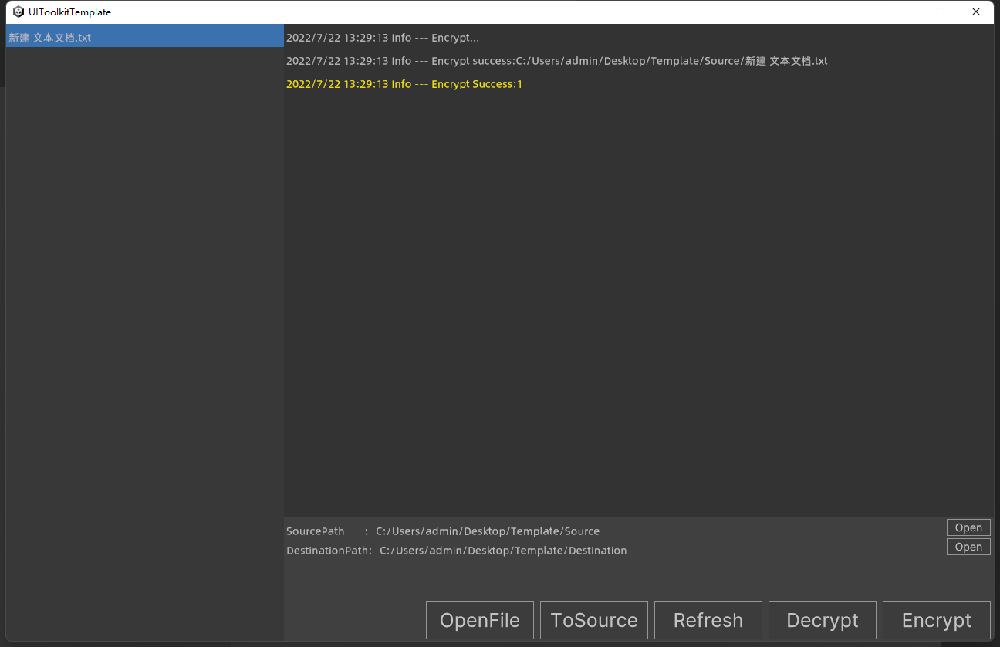

# UIToolkitTemplate

## 闲述
一直在尝试用UIToolkit构建运行时的界面，但是主项目没办法用，于是去年就用UIToolkit写了一个加密工具。

当时的UIToolkit还处于预览状态，以Package的形式加载。

最新的Unity2021.3里面UIToolkit已经是正式版而且内置到Unity里面了。

现在网上UITookit的资料相对较少，把这个模板工程开放给大家学习参考。

模板工程是个简单的加密工具，左侧是文件列表，右侧上半部分是log输出，下半部分是功能按钮。

大家可以基于这个模板简单改改做一些其他工具应该也挺好用的。

工程比较简单，里面代码也不是很合理，仅供参考了。

## 具体工程界面如下

[GitHub地址](https://github.com/t1633361/UIToolkitTemplate)

觉得有帮助的帮忙加个星，星多了，就有动力升级下模板

## Gossip
I have been trying to build the interface of the runtime with UIToolkit, but the main project can't use it, so last year I wrote a cryptographic tool in UIToolkit.

At that time, uiToolkit was still in preview, loading in the form of a Package.

The latest Unity2021.3 UIToolkit is already official and built into Unity.

Now there is relatively little information on the online UI Takenit, so I will open this template project to everyone for learning and reference.

The template project is a simple encryption tool, with a list of files on the left, a log output on the top right, and a function button in the bottom.

You can simply change some other tools based on this template should be very easy to use.

The project is relatively simple, and the code inside is not very reasonable, just for reference.

## The specific project interface is as follows

Feel helpful to help add a star, more stars, there is an incentive to upgrade the next template